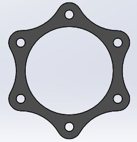
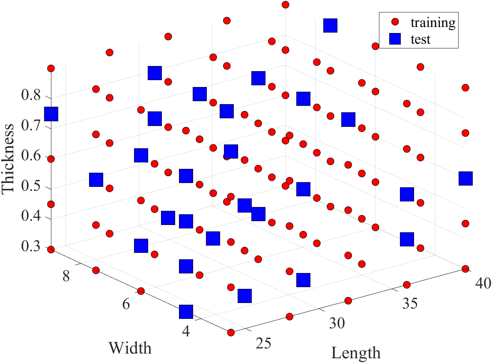
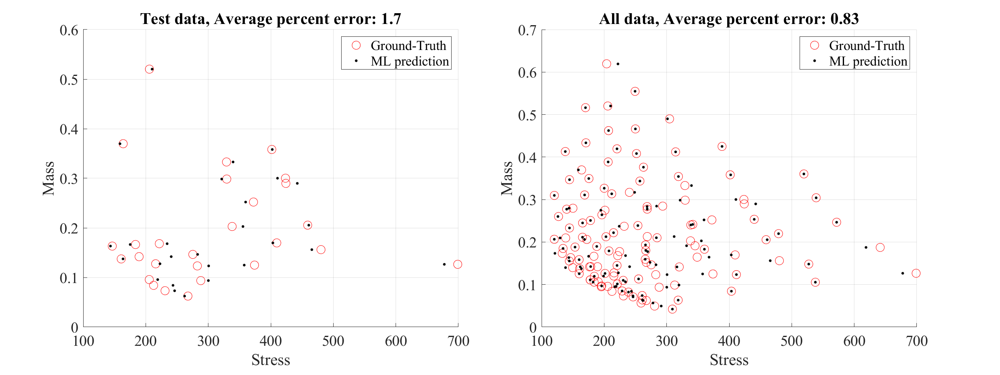
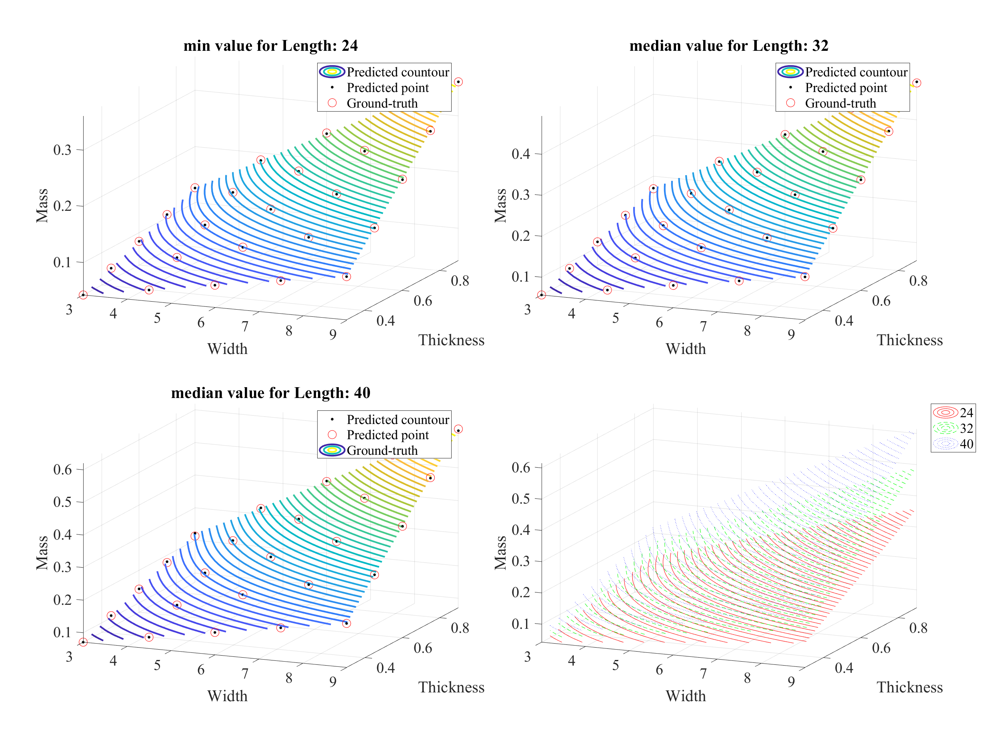
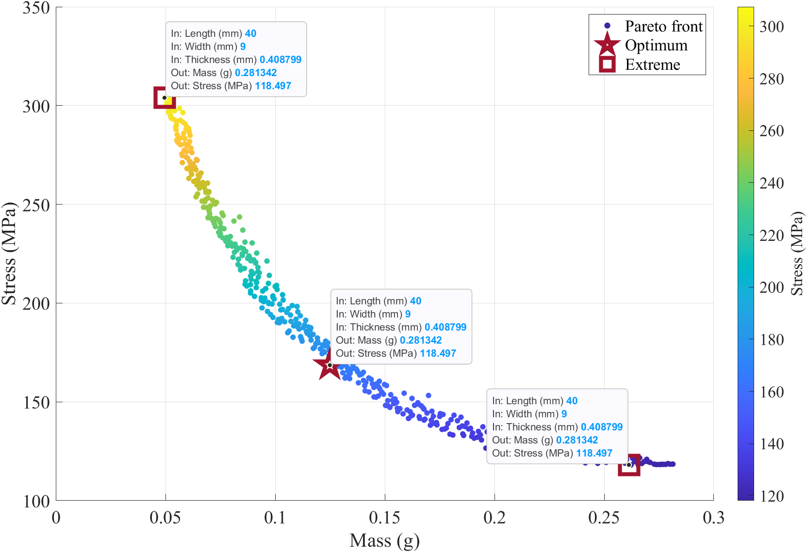
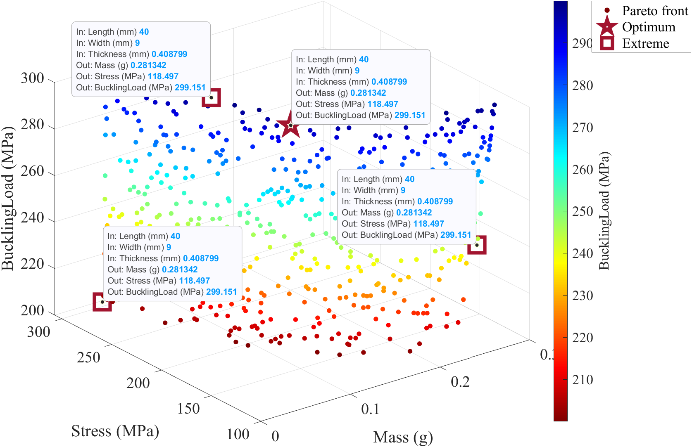
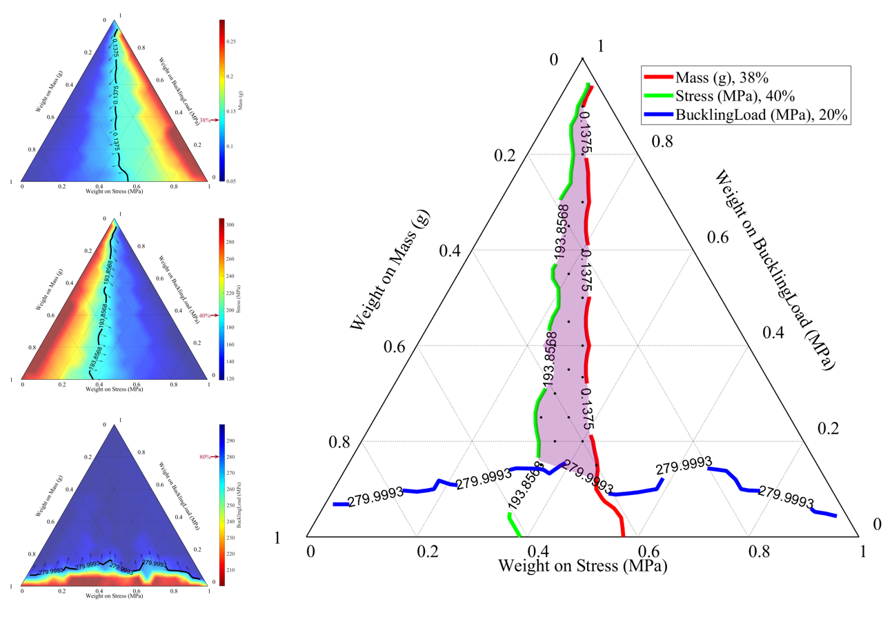

# Design Optimization Toolbox

This package was developed for engineering design optimization using Matlab software. This package integrates surrogate modeling and optimization algorithms from Deep Learning toolbox, Kriging [1], Generic algorithms [2], and Ternary analysis [3]. This package currently can handle multi-objective optimizations from single objective to four objectives.

Contact: Sungkwang Mun, sungkwan@cavs.msstate.edu

Center for Advanced Vehicular Systems, Mississippi State University, MS 39762

## 

## Contributors:

-   Gehendra Sharma, Mississippi State University
-   Daniela Tellkamp, Mississippi State University
-   Nayeon Lee, Mississippi State University
-   Luke Peterson, Mississippi State University

## Requirements:

-   Matlab version greater than 2021a
-   Matlab Deep Learning Toolbox

## Currently available surrogate modeling methods:

ANN (Artificial Neural Network) [4]: See ‘run_surrogate_ANN_part_design.m’ file for detail.

KRG (Kriging) [1]: See ‘run_surrogate_KRG_part_design.m’ file for detail.

## Design Optimization by Genetic Algorithm (GA) and Ternary analysis:

GA[2]: See ‘run_optimization_GA_part_design.m’ file for detail.

Ternary analysis: See ‘run_optimization_ternary_part_design.m’ file for detail.

## How to use:

**\<Model construction\>**

1.  Prepare CSV or XLS file for training database and put under the ‘_data’ folder.
2.  Change the ‘filename_data’ variable in the surrogate modeling code (e.g. run_ANN_training_part_design.m file) to the same name as the training database excel file.
3.  Run the surrogate modeling code to train a model. Repeat the process by changing the hyperparameters described in each approach until it achieves the desired prediction accuracy.

**\<Design optimization through genetic algorithm\>**

1.  Copy the location of the pretrained model printed on the screen to the model_name variable in the optimization code (e.g. run_GA_optimization_part_design.m file) and change the parameters accordingly.

```
Model location: ./trained_model/designA/trained_model_designA__hl_20_20_nd_100_tr_0.7_0_0.3_i_1234.mat
```

Change the domain of design space, i.e., min/max boundary and other parameters value.

1.  Run the optimization code, which will show GUI for intermediate changes in the file.

**\<Design optimization through ternary analysis\>**

1.  Once GA process is done, copy the location of the pretrained model printed on the screen to the result_name variable in the optimization code (e.g. run_ternary_part_design.m file) and change the parameters accordingly.

```
GA results file saved to results/GA/ANN_nPop_500_nIter_100.mat
```

1.  Run the optimization code, which will show ternary analysis results.

## Example problem: Coupling Design

-   Problem description: The example problem involves design of a flexible disc element (see figure below) that is the critical component of disc coupling. These disc elements are generally stacked together and connected between rotating parts. Due to the nature of how these elements get loaded during operation, they are prone to failure due to stretching and/or buckling. Hence, these are to be designed to resist failure due to buckling as well as tensile stretch.

    

-   Design space: Considering the symmetry of disc element, the segment shown in the figure below was utilized for running the simulation where design variables in discs design are length as l, width as b, and thickness as t. Design variables, their bounds and design objectives considered are tabulated in the table below. A full factorial experiment was run at 5 levels in SolidWorks to generate the design data. The design data consisted of mass, stress and buckling load for various combination of length, width, and thickness. With the help of these data, our intention is to identify designs (combination of length, width, and thickness) that minimizes mass, stress while maximizing buckling load. We generate ternary plots to visualize solution space to enable designers to identify design solutions that simultaneously satisfy these multiple design objectives.

| Variable Bounds | Design Variables | Design Objectives |              |                           |
|-----------------|------------------|-------------------|--------------|---------------------------|
|                 | Length mm        | Width mm          | Thickness mm |                           |
| Lower           | 24               | 3                 | 0.3          | Mass Stress Buckling Load |
| Upper           | 40               | 9                 | 0.9          |                           |

-   Split Training/Test dataset



-   Prediction accuracy for more than two objectives

    

-   Prediction accuracy for three design variables

    

-   Genetic algorithm results for two objectives with custom data tooltip that shows the input variables and output responses together (color code represents y-axis value)



-   Genetic algorithm results for three objectives with custom data tooltip that shows the input variables and output responses together (color code represents z-axis)



-   Ternary plots



Table 1 List of the points in the super imposed area in the ternary plot (screen output and csv file)

| w1    | w2    | w3    | Mass (g)    | Stress (MPa) | BucklingLoad (MPa) | Length (mm) | Width (mm)  | Thickness (mm) |
|-------|-------|-------|-------------|--------------|--------------------|-------------|-------------|----------------|
| 0     | 0     | 1     | 0.119541441 | 185.7132212  | 299.9983503        | 29.79841487 | 6.046784002 | 0.345390639    |
| 0.05  | 0.05  | 0.9   | 0.134054295 | 170.7645407  | 299.6560338        | 32.04828585 | 6.027462975 | 0.360210577    |
| 0.1   | 0.1   | 0.8   | 0.134054295 | 170.7645407  | 299.6560338        | 32.04828585 | 6.027462975 | 0.360210577    |
| 0.15  | 0.15  | 0.7   | 0.134054295 | 170.7645407  | 299.6560338        | 32.04828585 | 6.027462975 | 0.360210577    |
| 0.2   | 0.15  | 0.65  | 0.119541441 | 185.7132212  | 299.9983503        | 29.79841487 | 6.046784002 | 0.345390639    |
| 0.2   | 0.2   | 0.6   | 0.134054295 | 170.7645407  | 299.6560338        | 32.04828585 | 6.027462975 | 0.360210577    |
| 0.25  | 0.2   | 0.55  | 0.119541441 | 185.7132212  | 299.9983503        | 29.79841487 | 6.046784002 | 0.345390639    |
| 0.25  | 0.25  | 0.5   | 0.134054295 | 170.7645407  | 299.6560338        | 32.04828585 | 6.027462975 | 0.360210577    |
| 0.3   | 0.25  | 0.45  | 0.119541441 | 185.7132212  | 299.9983503        | 29.79841487 | 6.046784002 | 0.345390639    |
| 0.3   | 0.3   | 0.4   | 0.134054295 | 170.7645407  | 299.6560338        | 32.04828585 | 6.027462975 | 0.360210577    |
| 0.333 | 0.333 | 0.333 | 0.134054295 | 170.7645407  | 299.6560338        | 32.04828585 | 6.027462975 | 0.360210577    |
| 0.35  | 0.25  | 0.4   | 0.112978423 | 190.7172743  | 295.8608416        | 29.70883705 | 5.610907182 | 0.351908425    |
| 0.35  | 0.3   | 0.35  | 0.112978423 | 190.7172743  | 295.8608416        | 29.70883705 | 5.610907182 | 0.351908425    |
| 0.35  | 0.35  | 0.3   | 0.134054295 | 170.7645407  | 299.6560338        | 32.04828585 | 6.027462975 | 0.360210577    |
| 0.4   | 0.3   | 0.3   | 0.112978423 | 190.7172743  | 295.8608416        | 29.70883705 | 5.610907182 | 0.351908425    |
| 0.4   | 0.35  | 0.25  | 0.112978423 | 190.7172743  | 295.8608416        | 29.70883705 | 5.610907182 | 0.351908425    |
| 0.4   | 0.4   | 0.2   | 0.131015905 | 171.717648   | 285.9603969        | 32.21457537 | 5.876735928 | 0.35882331     |
| 0.4   | 0.45  | 0.15  | 0.137084825 | 166.6273727  | 288.9396519        | 28.60275488 | 8.481549976 | 0.3            |
| 0.45  | 0.3   | 0.25  | 0.112978423 | 190.7172743  | 295.8608416        | 29.70883705 | 5.610907182 | 0.351908425    |
| 0.45  | 0.35  | 0.2   | 0.114560149 | 188.3709795  | 289.767709         | 29.76896133 | 5.770885662 | 0.346572356    |
| 0.5   | 0.35  | 0.15  | 0.110040048 | 192.8528375  | 284.5495937        | 29.25784749 | 5.699318321 | 0.343043148    |

## References:

[1]: FAC Viana, SURROGATES Toolbox User's Guide, Gainesville, FL, USA, version 3.0 ed., 2011, available at https://sites.google.com/site/srgtstoolbox/.

[2]: Song Lin, NGPM—NSGA_II Program in Matltab, v.1.6.0.0, 2011 <https://www.mathworks.com/matlabcentral/fileexchange/31166-ngpm-a-nsga-ii-program-in-matlab-v1-4>

[3]: Ulrich Theune, Ternary Plots, v.1.0.0.0, 2005, <https://www.mathworks.com/matlabcentral/fileexchange/7210-ternary-plots>

[4]: Daniela F. Tellkamp, Gehendra Sharma, Nayeon Lee, Sungkwang Mun, and Luke Peterson, Design Optimization of Deployable Protective Wall for Blast and Impact Mitigation Using Finite Element-Derived Surrogate Models, to be submitted.
